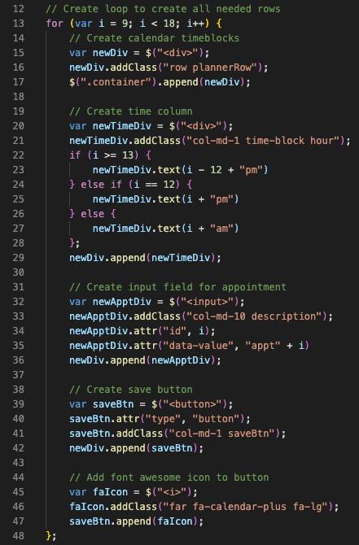
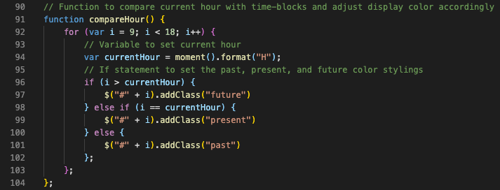
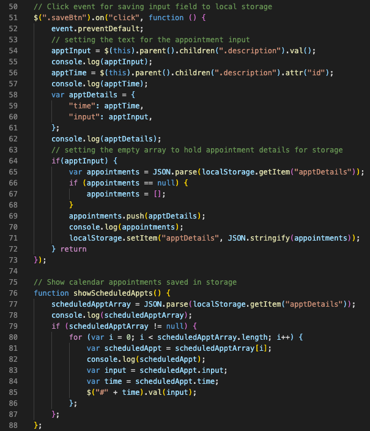
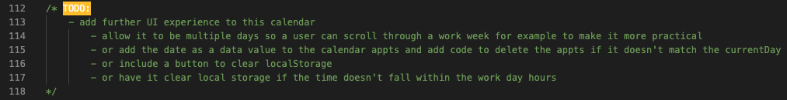
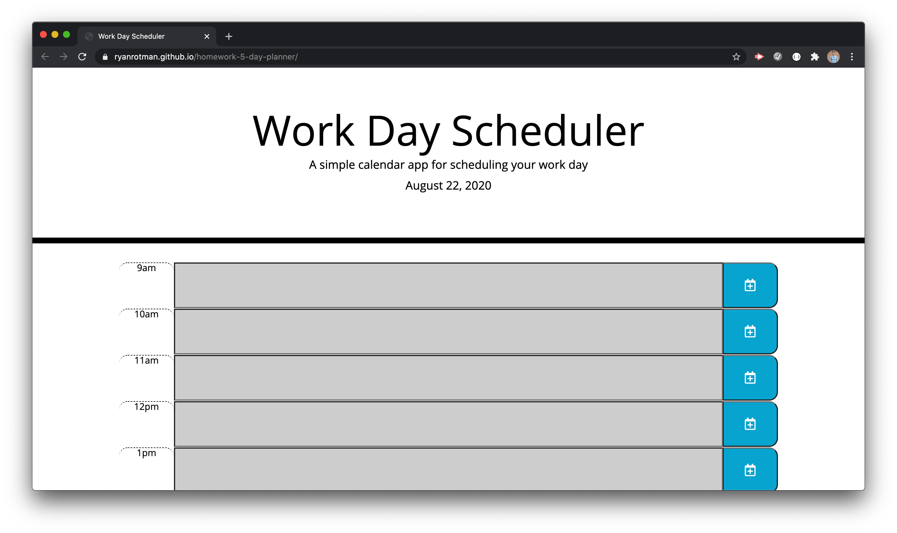
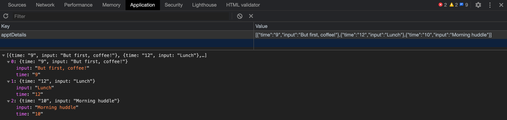
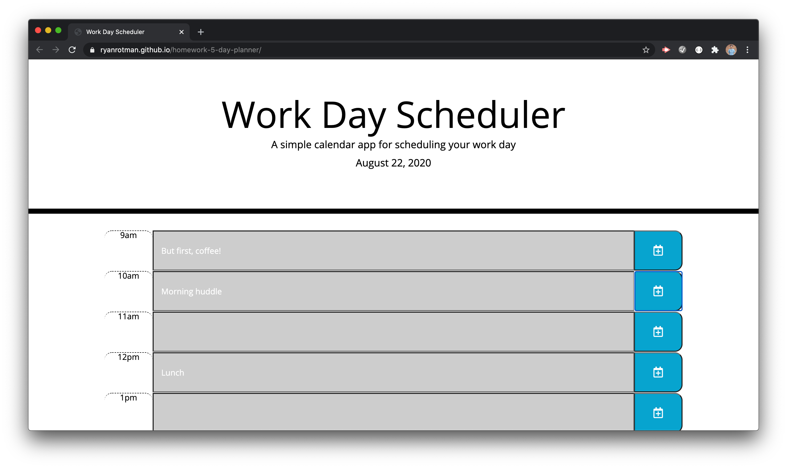

# Homework 5: Day Planner

## Description
This repository holds the fifth homework assignment for [The Coding Boot Camp](https://techbootcamps.utexas.edu/coding/) through the University of Texas at Austin's Center for Professional Education.

This project further expanded my knowledge and use of creating applications with JavaScript. This project in particular was designed dynamically through JavaScript using [jQuery](https://jquery.com/). This project allowed for users to fill in appointments within a typical workday calendar, save those appointments to local storage, and have those appointments persist if the browser is refreshed by use of JSON stringify and parse elements. This calendar application also used background color changes for past, present, and future appointments depending on the current hour. To make this part of the application work, I was introduced to the [Moment.js](https://momentjs.com/) library. Even though this project only used the current day and the current hour, this library allows for extensive use in the display of dates and times within JavaScript.

## Notes
* HTML elements were created dynamically through the use of jQuery. This included creating elements, adding classes, setting attributes, and appending those elements.
    > 

* Using for loops, different values for the variables that tied to id's set within specific elements and then using concatenation to target the specific elements.
    > 

* JSON to store and view user inputed appointments.
    > 

* Processing and planning for further changes to this project to make a better and more practical user experience
    > 

## Page Screenshots
Opening page with no calendar appointments present

User inputed calendar appointments saved in local storage

Refreshed page with calendar appointments persisting

## Link
Github Pages Link: [https://ryanrotman.github.io/homework-5-day-planner/](https://ryanrotman.github.io/homework-5-day-planner/)